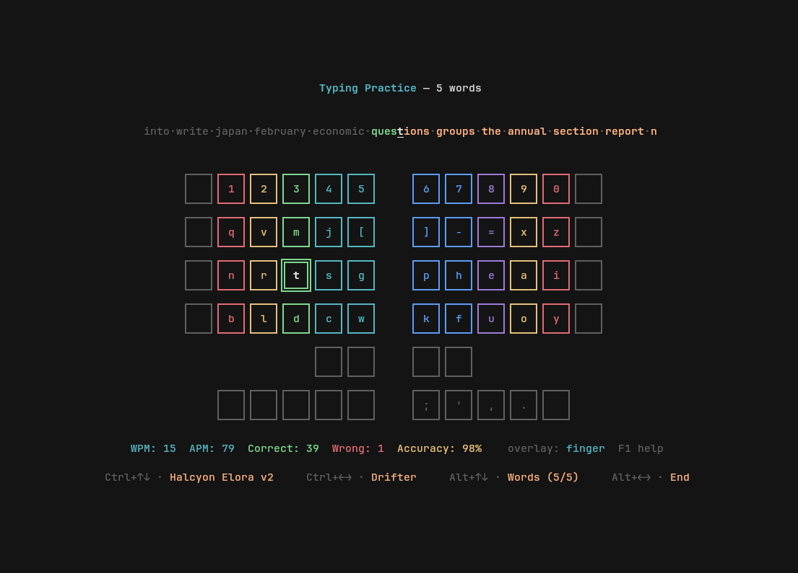
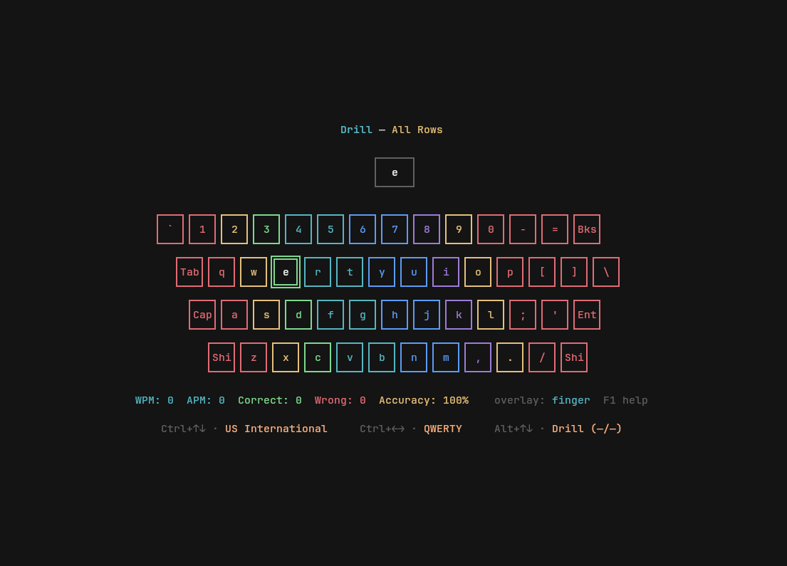
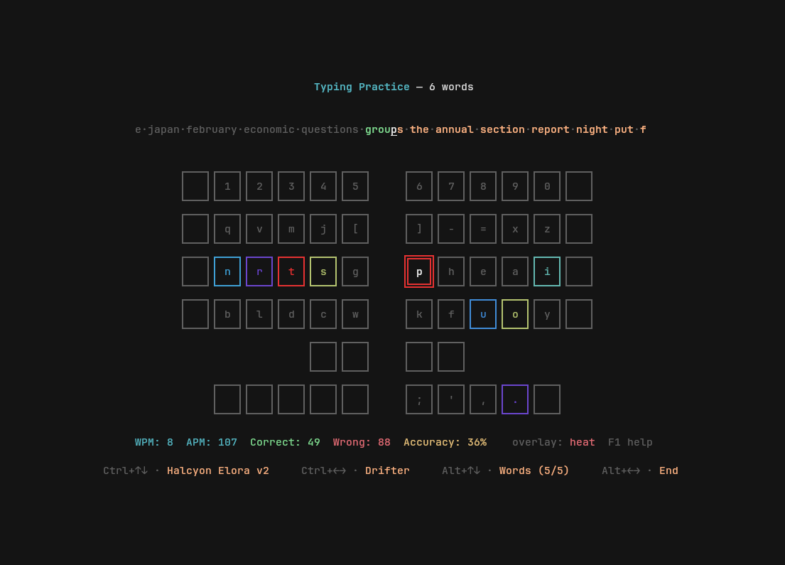
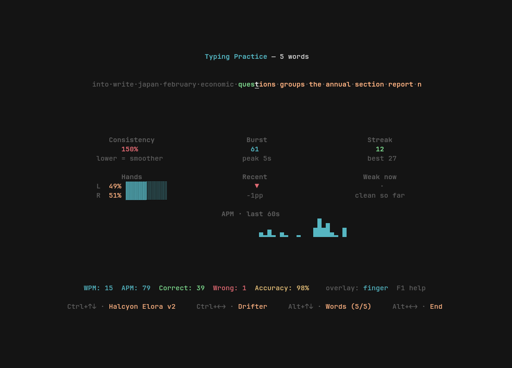
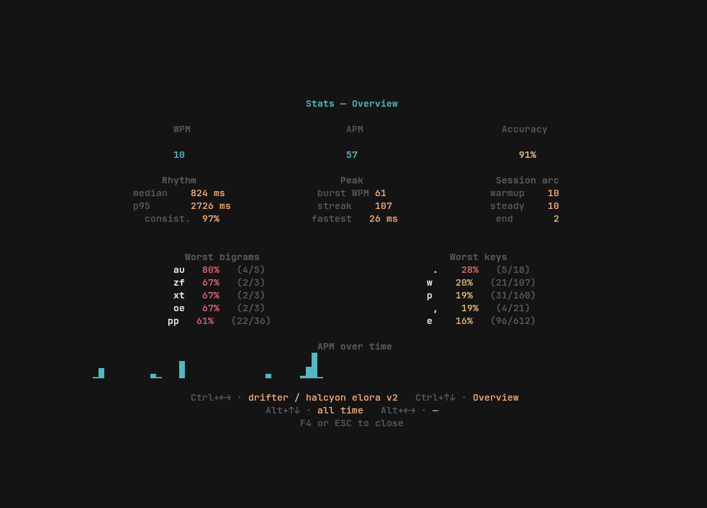
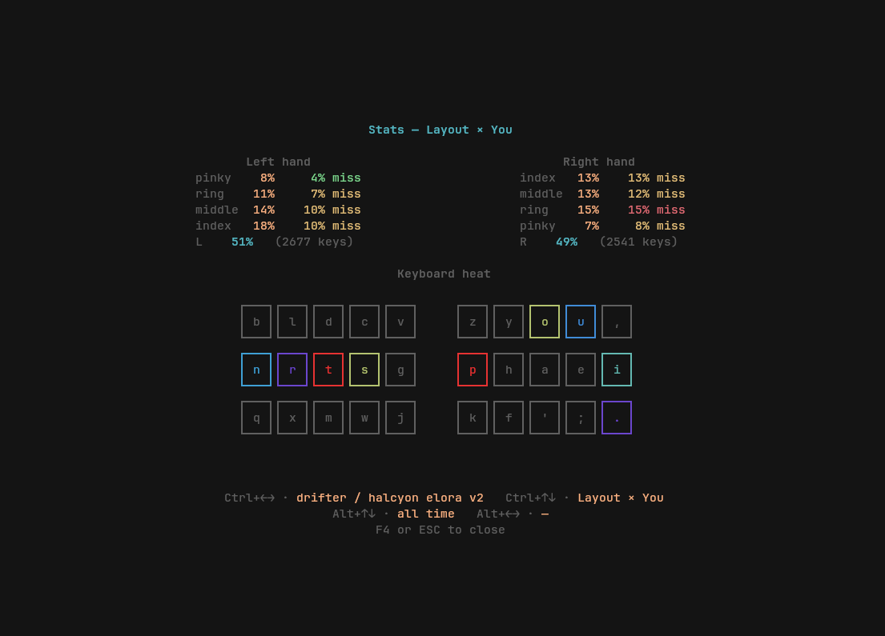

# keywiz

A terminal **layout workbench**: design a keyboard layout, train on
it, measure how it actually performs for you, iterate. Three
integrated tools in one binary.

<p align="center">
  
</p>

## What it is

keywiz started as a typing tutor for custom layouts (typr was
broken, and no other tool could render a non-QWERTY keyboard with
its real geometry). It grew into three layers:

1. **drift** — a layout scorer with pluggable analyzers.
   Reads oxeylyzer corpora, imports `.dof`, runs delta scoring
   across layouts. Tier 1 complete (189 public layouts score,
   JSON output, layout diffs, per-analyzer CLI overrides).
2. **keywiz-stats** — an event-stream statistics crate.
   Every keystroke is recorded with its expected char, typed
   char, timestamp, and inter-keystroke delay against a
   content-hashed layout + keyboard snapshot. Drifter v1 and
   drifter v2 have different hashes — same name, different
   iterations. Event stream is the source of truth; views
   aggregate on read.
3. **keywiz** — the typing trainer itself. Terminal UI with a
   rendered keyboard, three exercises (drill, words, text),
   and a two-modal stats surface (F4 performance, F5 layout
   iterations).

The workflow is end-to-end: design a layout → score it with drift
→ train on it → see whether the theoretical gains match your
actual measured experience → iterate.

## Install

```sh
cargo install --path .
```

## Quick start

```sh
# Run keywiz (typing trainer)
keywiz

# Pick keyboard + layout by name
keywiz -k halcyon_elora_v2 -l drifter
keywiz -k us_intl -l qwerty

# Practice a layout while typing on a different physical keyboard
keywiz -l drifter --from qwerty

# Run drift (layout scorer) through keywiz's forwarding
keywiz --drift score layouts/drifter.json
keywiz --drift compare layouts/drifter.json layouts/gallium-v2.json
keywiz --drift --preset drifter score layouts/drifter.json
```

## The typing trainer

Three exercise categories, cycled with **Alt+↑/↓**:

- **Drill** — random keys with adaptive difficulty. Starts on
  whichever row has the hottest troubled keys; promotes at
  >90% accuracy, demotes below 70%.
- **Words** — endless random words with a scrolling display.
  One instance per wordlist in `words/`; **Alt+←/→** cycles
  between lists (English, short words, whatever you drop in).
  keywiz is a layout workbench, not a typing speedrunner — no
  20-word finish line; the stats page is where numbers live.
- **Text** — type real passages from `texts/`. Arrow within the
  category to switch passages.

### Visual keyboard + overlays

The active layout renders as a real keyboard with the correct
geometry — split, ortho, row-stag, col-stag, column offsets, key
widths. **F2** cycles the overlay:

- **none** (default) — quiet baseline
- **finger** — per-finger colors (the classic "rainbow")
- **heat** — per-key heat tinting that updates live as you type

**Shift+Tab** toggles the flash layer — the last-pressed key
flashes white → light yellow → cyan over ~250 ms on top of
whatever overlay is painting. Off by default.

<table>
  <tr>
    <td></td>
    <td></td>
  </tr>
</table>

**Tab** hides/shows the keyboard entirely, falling back to a
dense inline stats dashboard (see below).

### Live performance readout

The footer carries WPM / APM / Correct / Wrong / Accuracy in
real time. With **F3**'s inline stats slot, you get a six-panel
dashboard instead of the keyboard picture:

- **Consistency** — coefficient of variation of inter-keystroke
  delay (lower = smoother rhythm)
- **Burst** — peak 5-second rolling WPM
- **Streak** — correct-in-a-row (current + best this session)
- **Hands** — L/R load bars with miss rate; dominant hand
  highlights when split > 10pp
- **Recent** — last-30-keystroke accuracy vs session average
  with an up/down arrow
- **Weak now** — worst bigram in the active scope, live
- **APM sparkline** — last 60 seconds bucketed, right-aligned

<p align="center">
  
</p>

### F4 — stats page (how am I typing)

<table>
  <tr>
    <td></td>
    <td></td>
  </tr>
</table>

Three pages, cycled with **Ctrl+↑/↓**:

- **Overview** — numbers + Rhythm / Peak / Session arc columns
  + worst bigrams + worst keys + APM sparkline. "Session arc"
  splits your session into warmup / steady / end so you can see
  if you're fading or ramping.
- **Progression** — WPM sparkline + per-bucket table over days
  / weeks / months / years. Calendar-correct via chrono.
- **Layout × You** — per-finger load & miss rate, L/R balance,
  and a heat-painted mini keyboard for the current time bucket.
  Walk **Alt+←/→** to watch hot keys cool across sessions.

Filter scope cycles with:

- **Ctrl+←/→** — (layout, keyboard) combo
- **Alt+↑/↓** — granularity (session / day / week / month / year / all)
- **Alt+←/→** — walk the offset (P1/P3) or range width (P2)

### F5 — layout iterations (how is the layout)

F4 asks *how you're typing*. F5 asks *how the layout is
performing across its content-hash iterations.* Swap two keys in
the layout JSON and the next session lands under a new hash. F5
shows every hash as a row in a table with date range, session
count, keystrokes, aggregate WPM, and accuracy — so "did that
swap help?" has an honest answer.

## The layout scorer (drift)

```sh
keywiz --drift score layouts/drifter.json
keywiz --drift score --preset oxey_mimic layouts/drifter.json
keywiz --drift compare layouts/drifter.json layouts/gallium-v2.json
keywiz --drift generate --preset drifter
```

drift is a 13-crate workspace at `drift/`:

- Compiler-enforced dependency graph (drift-core → drift-motion
  → drift-analyzer → drift-analyzers → …)
- 20 analyzers spanning finger use, rolls, scissors, row skips,
  partial alternation
- 4 presets (drifter, oxey_mimic, extension, neutral)
- N-gram derivation, `.dof` import, JSON output, per-analyzer
  CLI overrides

`keywiz --drift` forwards in-process — bit-identical output
versus calling `drift` directly. See
[`drift/docs/HANDOFF.md`](drift/docs/HANDOFF.md) for depth.

## Keybind reference

### Typing view

| Key | Action |
|---|---|
| `F1` | Help page (this table) |
| `F2` | Cycle overlay (none / finger / heat) |
| `F3` | Cycle slot content (keyboard / inline stats) |
| `F4` | Stats page (performance) |
| `F5` | Layout iterations |
| `Tab` | Hide / show the keyboard slot |
| `Shift+Tab` | Toggle flash layer |
| `Ctrl+↑/↓` | Previous / next keyboard |
| `Ctrl+←/→` | Previous / next layout |
| `Alt+↑/↓` | Previous / next exercise category |
| `Alt+←/→` | Previous / next exercise instance |
| `Esc` | Quit (or close an open modal) |

### Inside the F4 stats modal

Same keys, rebound to filter / page axes:

| Key | Action |
|---|---|
| `Ctrl+←/→` | Cycle (layout, keyboard) combo |
| `Ctrl+↑/↓` | Cycle stats page (Overview / Progression / Layout × You) |
| `Alt+↑/↓` | Cycle time granularity |
| `Alt+←/→` | Walk offset (P1/P3) or range width (P2) |
| `F4` / `Esc` | Close |

## Adding layouts and keyboards

Both are JSON5. Drop a file in `keyboards/` or `layouts/` and it
appears in the cycle on next launch.

**Keyboards** describe physical buttons: id, grid coord (r,c),
geometric position + width/height, finger assignment, cluster.
See `keyboards/halcyon_elora_v2.json` (col-stag split reference)
or `keyboards/us_intl.json` (row-stag ANSI).

**Layouts** map physical key ids to
`{ char: ["a", "A"] }` or `{ named: "shift" }`. See
`layouts/drifter.json` for a documented example with its design
theses.

For hardware-specific overrides: name a layout file
`{layout}-{keyboard}.json` (e.g. `qwerty-halcyon_elora_v2.json`).
It wins over the generic when paired with that keyboard and
stays hidden from the layout cycle otherwise.

## Shipped data

- **Keyboards**: `halcyon_elora_v2` (col-stag split, aggressive
  splay), `kyria` (col-stag split, aggressive splay, no number
  row), `ferris` (col-stag split, 34 keys, aggressive splay, no
  number row or outer pinky), `lily58` (col-stag split, mild
  splay, 58 keys with number row), `corne` (col-stag split, mild
  splay, 42 keys, no number row), `us_intl` (ANSI row-stag),
  `ortho`
- **Layouts**: `canary`, `colemak`, `colemak-dh`, `drifter`,
  `dvorak`, `engram`, `gallium`, `gallium-v2`, `graphite`,
  `hyperroll`, `isrt`, `qwerty`, `semimak`, `sturdy`, `workman`
- **Variants** (auto-resolved per keyboard, hidden from cycle):
  `canary-halcyon_elora_v2`, `canary-kyria`,
  `qwerty-halcyon_elora_v2`

## Custom texts

Add `.txt` files to `texts/`:

```
Title Goes Here
The rest of the file is the passage body. Multiple lines are
fine — they get word-wrapped to fit the display.
```

## Custom wordlists

Drop `.txt` files into `words/`, one word per line. The filename
becomes the list title (`short_words.txt` → "Short Words"), so
lists downloaded from external sources work without editing.
Each file shows up as a selectable instance in the words exercise
(**Alt+←/→**).

## Storage

- Stats: `~/.local/share/keywiz/stats.sqlite` (SQLite via
  bundled rusqlite)
- Preferences: `~/.local/share/keywiz/prefs.json` (last
  keyboard / layout / exercise / overlay)

Event storage is append-only. A heavy user writes ~1M events
per year; SQLite handles that with headroom. Nothing is summed
or compacted on write — views aggregate on read, so a bug in
one view can't poison another.

## Project layout

```
keywiz/
├── src/                 — keywiz binary
├── drift/crates/        — 13-crate drift workspace
├── keywiz/crates/
│   └── keywiz-stats/    — event store + views
├── keyboards/           — JSON5 keyboards
├── layouts/             — JSON5 layouts
├── texts/               — text-practice passages
├── words/               — one .txt per wordlist
└── docs/
    ├── HANDOFF.md       — current state, next-up
    ├── roadmap.md       — tiered roadmap
    ├── stats-ideas.md   — stats-modal design doc
    └── architecture-plan.md
```

## License

AGPL-3.0 — see [LICENSE](LICENSE).
