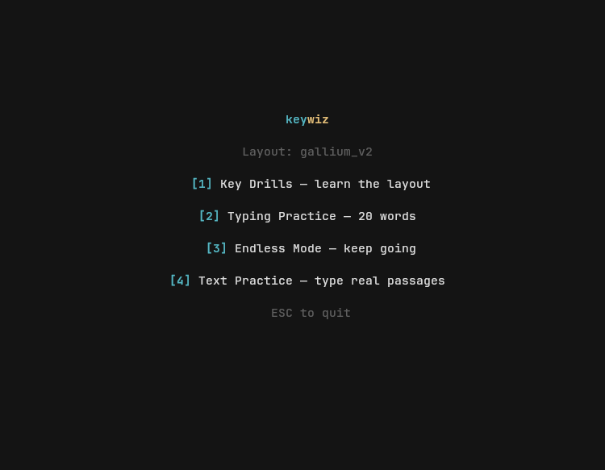
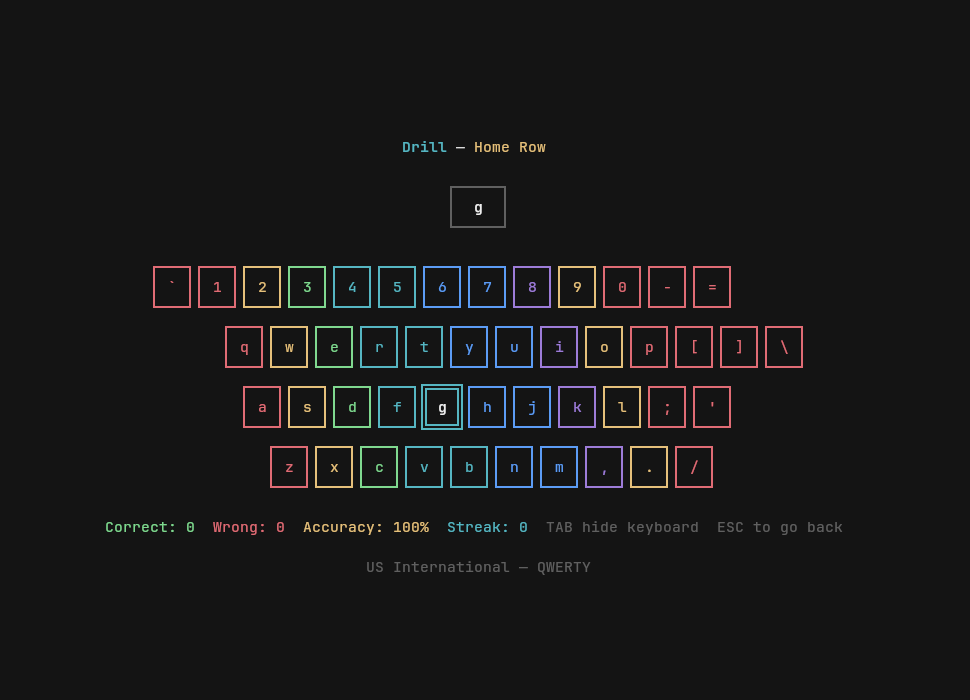
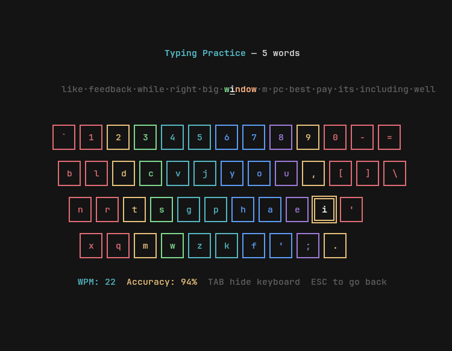
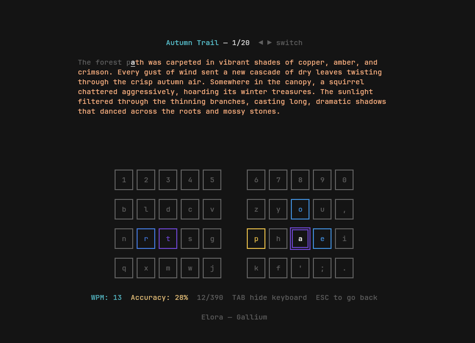

# keywiz

A terminal typing tutor with a visual keyboard — built for custom layouts that no other tool supports.

## Screenshots

| | |
|---|---|
|  |  |
| **Mode selection** | **Key Drills** — adaptive level progression |
|  |  |
| **Typing Practice** — live WPM and accuracy | **Text Practice** — real passages, split view |

## Features

- **Visual keyboard** with color-coded finger zones
- **Key drills** with adaptive difficulty — starts on home row, levels up/down based on rolling accuracy
- **Typing practice** with scrolling word display and live WPM/accuracy
- **Endless mode** — continuous practice without a word limit
- **Text practice** — type through real passages, arrow keys to switch texts
- **Split keyboard view** for columnar split boards (Elora, Corne, Sweep, etc.)
- **Toggle keyboard** with Tab — fly blind when you're ready
- **Input translation** — practice any layout on any keyboard (e.g. train Gallium v2 on a QWERTY tablet over SSH)
- **Reads kanata configs** directly — no separate layout file needed
- Runs in the terminal, no GUI dependencies

## Install

```sh
cargo install --path .
```

## Usage

```
keywiz [options] [kanata-config] [layer-to-train]
```

```sh
# Auto-detects config (~/.config/kanata/kanata.kbd) and first layer
keywiz

# Train a specific layer
keywiz /path/to/kanata.kbd gallium_v2

# Split keyboard mode
keywiz --split

# Your keyboard sends QWERTY, but you want to train Gallium v2
keywiz --from qwerty

# Your keyboard sends Colemak (defined in your kanata config), train Gallium v2
keywiz --from colemak gallium_v2
```

### Training on a different keyboard

If your physical keyboard doesn't run your target layout (e.g. SSHing from a tablet), use `--from` to tell keywiz what layout your keyboard actually sends. Keywiz translates each keypress by physical position — pressing QWERTY `j` registers as whatever your target layout has in that position (e.g. `h` on Gallium v2).

```sh
# SSH into your desktop from an Android tablet with a QWERTY keyboard
ssh desktop
keywiz --from qwerty
```

The `--from` value can be `qwerty` (built-in) or any layer name defined in your kanata config. This means if you have two custom layouts in the same config file, you can practice one while typing on the other.

This way you can practice anywhere without needing kanata, custom Android IMEs, or any special setup on the device you're typing on.

### Modes

- **[1] Key Drills** — random keys, starts with home row. Levels up at >90% accuracy, back down below 70%.
- **[2] Typing Practice** — type 20 words with a scrolling display and keyboard guide.
- **[3] Endless Mode** — like typing practice, but it never ends. ESC to stop.
- **[4] Text Practice** — type through real passages from the `texts/` directory. Arrow left/right to switch between texts.

### Controls

- **Tab** — toggle keyboard visibility
- **Shift+Tab** — toggle split / standard keyboard
- **◀ ▶** — switch passages (text practice mode)
- **ESC** — go back / quit

## Layout Support

Keywiz reads keyboard layouts from [kanata](https://github.com/jtroo/kanata) configuration files, including `tap-hold` aliases. The layout system is modular — adding parsers for other formats (QMK, KMonad, etc.) is straightforward.

## Custom Texts

Add `.txt` files to the `texts/` directory for text practice mode. Format:

```
Title Goes Here
The rest of the file is the passage text that you'll type through.
Multiple lines are fine — they get word-wrapped to fit the display.
```

## License

AGPL-3.0 — see [LICENSE](LICENSE).
